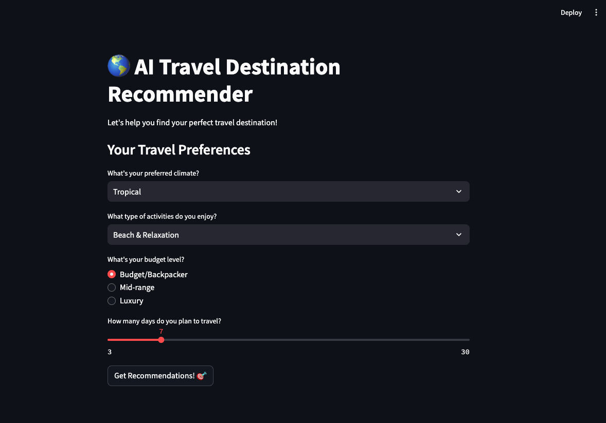

# EXPLAINER.md

## 🌎 AI Travel Destination Recommender



### Introduction

Ever wanted to travel but didn’t know where to go? This AI-powered travel recommender helps users find perfect travel destinations based on their preferences like climate, activities, budget, and trip duration. It uses **Google Gemini AI** to suggest customized travel ideas!

### How It Works

This project is built using **Streamlit**, a Python framework for creating interactive web apps. The AI (Google Gemini) takes user inputs and generates personalized travel suggestions.

---
## Iterations
The application progresses through four iterations, each adding new features and complexity:

### Iteration 1 (Basic Version)
- Simple climate and activity inputs
- Basic AI prompt
- Single destination recommendation
- Minimal error handling

### Iteration 2 (Added User Preferences)
- Added budget selection
- Added duration slider
- Enhanced prompt with more details
- Basic error handling
- Two destination recommendations

### Iteration 3 (Enhanced UI)
- Improved UI with emojis and sections
- Loading spinner
- More climate and activity options
- Enhanced prompt with more details
- Three destination recommendations
- Added animations (balloons)

### Iteration 4 (Complete Version)
- Added unique facts to recommendations
- More detailed error handling
- Complete UI polish
- Comprehensive documentation
- Future-ready for image handling

---

## 🔍 Breakdown of the Code

### 1️⃣ **Importing Required Libraries**

```python
import streamlit as st
import google.generativeai as genai
import os
from dotenv import load_dotenv
from PIL import Image
```

- **streamlit**: Creates an interactive web app.
- **google.generativeai**: Connects to Google Gemini AI for travel recommendations.
- **os**: Helps access environment variables (for API keys).
- **dotenv**: Loads environment variables from a `.env` file.
- **PIL (Pillow)**: (Unused in this code, but can be used to add travel images later!)

---

### 2️⃣ **Configuring the AI Model**

```python
load_dotenv()
genai.configure(api_key=os.getenv('GOOGLE_API_KEY'))
model = genai.GenerativeModel('gemini-1.5-pro')
```

- Loads the **Google API key** securely.
- Configures the **Gemini AI model** (`gemini-1.5-pro`).

---

### 3️⃣ **Defining the AI Travel Recommender Function**

```python
def get_travel_recommendations(climate, activity, budget, duration):
    prompt = f"""
    Suggest 3 travel destinations based on these preferences:
    - Preferred climate: {climate}
    - Desired activity type: {activity}
    - Budget level: {budget}
    - Trip duration: {duration} days
    
    For each destination, provide:
    1. City and Country
    2. Main attractions
    3. Estimated daily budget
    4. Best time to visit
    5. One unique fact
    
    Format each destination separately and clearly.
    """
    response = model.generate_content(prompt)
    return response.text
```

- Creates a **prompt** with user’s choices.
- Calls **Gemini AI** to generate **custom travel recommendations**.
- Returns **formatted travel destinations**.

---

### 4️⃣ **Creating the Web App Interface**

```python
def main():
    st.title("🌎 AI Travel Destination Recommender")
    st.write("Let's help you find your perfect travel destination!")
```

- Sets up the **Streamlit UI** with a title and introduction.

#### 📌 User Inputs (Dropdowns, Radio Buttons, and Sliders)

```python
    climate = st.selectbox("What's your preferred climate?", ["Tropical", "Mediterranean", "Cold/Snow", "Desert", "Temperate"])
    
    activity = st.selectbox("What type of activities do you enjoy?", ["Beach & Relaxation", "Adventure & Sports", "Cultural & Historical", "Nature & Wildlife", "Food & Shopping"])
    
    budget = st.radio("What's your budget level?", ["Budget/Backpacker", "Mid-range", "Luxury"])
    
    duration = st.slider("How many days do you plan to travel?", 3, 30, 7)
```

- Lets users **choose** their preferences using **dropdowns, radio buttons, and a slider**.

#### 🎯 **Getting AI Recommendations**

```python
    if st.button("Get Recommendations! 🎯"):
        with st.spinner("AI is finding perfect destinations for you..."):
            try:
                recommendations = get_travel_recommendations(climate, activity, budget, duration)
                
                st.subheader("🌟 Your Personalized Travel Recommendations")
                st.write(recommendations)
                
                st.balloons()
                
            except Exception as e:
                st.error(f"Oops! Something went wrong: {str(e)}")
                st.write("Please try again!")
```

- When the user clicks the **button**, it:
  - Shows a **loading spinner** ⏳
  - Calls the **AI recommender function** 🧠
  - Displays the **AI-generated travel recommendations** 🌍
  - Pops **balloons** 🎈 for fun!
  - Shows an **error message** if something goes wrong ❌

---

### 5️⃣ **Running the Streamlit App**

```python
if __name__ == "__main__":
    main()
```

- Ensures that the **main() function runs** when executing the script.

---

## 🚀 **How to Run the Project**

### Step 1️⃣: Install Required Packages

```sh
pip install streamlit google-generativeai python-dotenv pillow
```

### Step 2️⃣: Set Up API Key

- Create a `.env` file in the project folder and add:
  ```sh
  GOOGLE_API_KEY=your-api-key-here
  ```

### Step 3️⃣: Run the App

```sh
streamlit run filename.py
```

- Replace `filename.py` with the actual script name.

---

## 🎉 **What You Learned**

✅ How to create an **interactive travel recommendation app** 🗺️ ✅ How to use **Google Gemini AI** to generate dynamic responses 🤖 ✅ How to build a **user-friendly UI with Streamlit** 🖥️ ✅ How to take **user inputs** and process them in an AI prompt ✍️ ✅ How to **handle errors** and improve user experience 🚀

---

## 🔥 **Next Steps**

💡 Add **travel images** for each recommended destination! 🖼️ 💡 Allow users to **save and share** their recommendations! 💾 💡 Add a **budget calculator** for estimated costs! 💰

---

## 🌟 **Final Thoughts**

This project is a **fun and practical way** to learn about AI-powered recommendations! Whether planning a **vacation or just exploring** new places, this AI **makes trip planning easy** and interactive. 🌍✈️

Happy coding! 🚀

